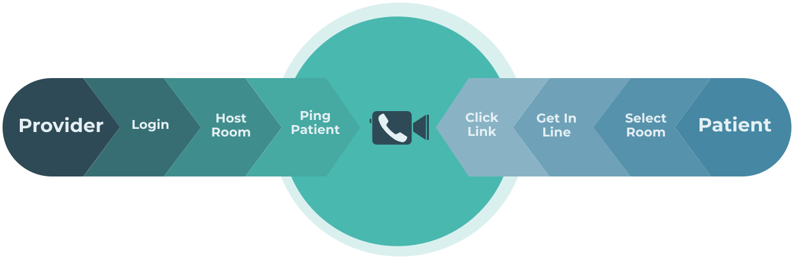

# Walkins Welcome [Demo Link](https://walkings-welcome.netlify.app/)  [](https://app.netlify.com/sites/walkings-welcome/deploys)


## [Dev.to](https://dev.to/)/[Twilio](https://www.twilio.com/) Online Hackathon  

 
 

This application is a proof of concept of providing professional care to people in need during social distancing. 
- The application allows professionals, to login in via their google account and create lobbies for their patients. 
- Patients do not need to login, when they vist the website, they "get in line" and wait for their turn.
- When the Doctor is ready to communicate, they click on the "Call next patient" button that will initialize their video call room 
- This will lead to the patient recieving a text messeage on their phone with a link to the video room where the two con converse.

The below image helps with understanding:




The long term goal would be to make such a service available to those in under developed countries and also expand the use case to include other professionals such as lawyers and therapists, educators the options are endless.

## Technologies used:
    1. React/Redux (client)
    2. Netlify client deployment
    3. ServerlessJs (server)
    4. AWS Lambda backend deployments
    5. Mlab (Mongo Database)
    6. Google Auth API
    7. Twilio Video Api
    8. Twilio SMS API
    9. Figma 


## Getting started
### Server 
1. Create config.json file in the serrver with the following format:
```
{
    "DB_USER": ""
    "DB_PASSWORD":""
    "TWILIO_ACCOUNT_SID": ""

    "TWILIO_MESSEGING_SID_KEY":""
    "TWILIO_MESSAGING_AUTH_TOKEN":""
    "TWILIO_PHONE_NUMBER":""
    
    "TWILIO_VIDEO_API_KEY":""
    "TWILIO_VIDEO_API_SECRET": ""

    "CLIENT_URL": ""
}
```
2. run `npm install` to install all the dependencies
3. run `serverless offline` to spin up the local server 


### Client
1. In the `client` dir, create a new .env file with the following properties:
```
REACT_APP_API_BASE_URL=http://localhost:3000/dev
REACT_APP_GOOGLE_CLIENT_ID=
REACT_APP_TWILIO_ACCOUNT_SID=
```

2.  In the `client` directory run `npm install`
3. run `npm run start` to start the server. 
    - Because serverless runs on port 3000, react will prompt you to change your port for the client


# Future TODOS:
- Currently, the error scenarios are not flully flushed out.
    - if there are no patients in the lobbby, when you try to call, there is a 400 but no message seen on the screen 
- Make use of patient description message in the video call to have a more informed session
- Refactor Lobby
- provide feedback loop of how many patients are currently waiting in the lobby
- provide multi language rooms
- whatsapp support
- filter rooms by speciality, language and country
- persist notes taken of consult for later review by both paties